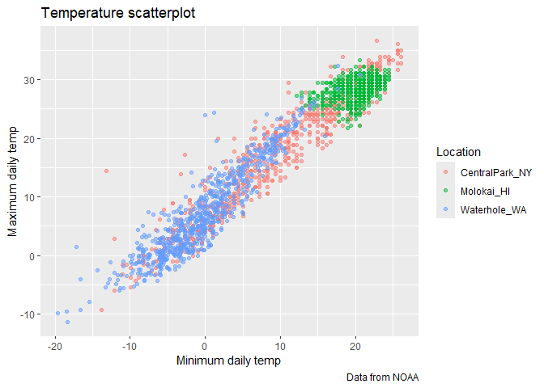

viz_2
================
Ruihan Ding
2025-09-30

Import the weather data.

``` r
data("weather_df")
```

Let’s make a basic scatterplot

``` r
weather_df |> 
  ggplot(aes(x = tmin, y = tmax)) +
  geom_point(aes(color = name), alpha = 0.5) +
  labs(
    x = "Minimum daily temp", 
    y = "Maximum daily temp", 
    title = "Temperature scatterplot", 
    caption = "Data from NOAA",
    color = "Location"
  )
```

    ## Warning: Removed 17 rows containing missing values or values outside the scale range
    ## (`geom_point()`).

<!-- -->

## Scales

``` r
weather_df |>
  filter(tmax > 10, tmin < 30) |> 
  ggplot(aes(x = tmin, y = tmax)) +
  geom_point(aes(color = name), alpha = 0.5) +
  labs(
    x = "Minimum daily temp", 
    y = "Maximum daily temp", 
    title = "Temperature scatterplot", 
    caption = "Data from NOAA",
    color = "Location"
  ) +
  scale_x_continuous(
    breaks = c(-20, 0, 25),
    labels = c("-20C", "0", "25")
  ) +
  scale_y_continuous(
    trans = "sqrt",
    limits = c(10, 30) # or filter(tmax > 10, tmin < 30) from the start
  ) +
  # scale_color_hue(h = c(100, 300)) or
  viridis::scale_color_viridis(
    name = "Location", 
    discrete = TRUE
  )
```

    ## Warning: Removed 160 rows containing missing values or values outside the scale range
    ## (`geom_point()`).

<!-- -->
